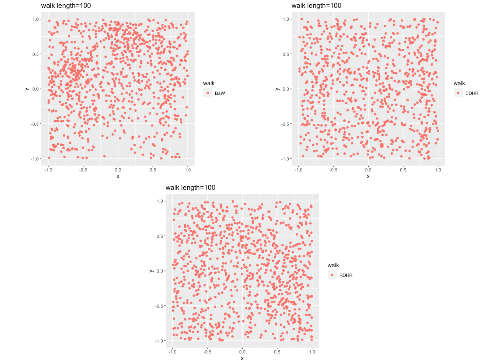
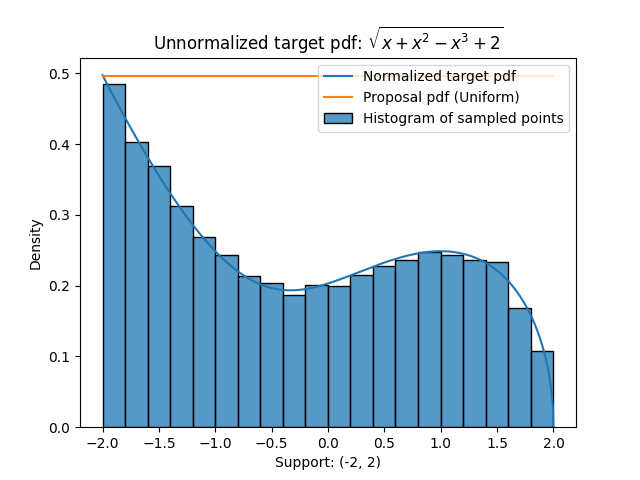
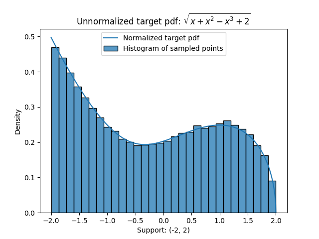
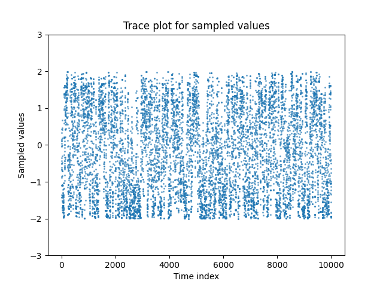

### Univariate-Truncated-Sampling for the project: "Sampling from a parametric polynomial curve"
*Sampling from univariate truncated distributions for GeomScale's tests for GSoC 2021*

## Easy
- Generated a 100 dimensional cube and sampled points using three different random walks:
  - ["Ball Walk", "Random Direction Hit and Run", "Change Direction Hit and Run"]
- Plots are sampled points projected along the first two dimensions: 
  

## Medium: Accept-Reject Sampling
- **Target pdf (Unnormalized) (F) :**  sqrt(x + x2 - x3 + 2), this pdf is chosen because its form is similar to the density functions obtained by norm of velocity vector of a parametric polynomial curve.  
- **Suppport :** (-2, 2)  
- **Proposal pdf (G) :** Uniform (-2, 2)  
> The code is written such that it also works for unnormalized pdf, maximum value **M** of **F(x)/G(x)** is calculated by evaluating the ratio over random uniform samples over the support.
> The samples points were written into `data_1.txt` and plotted using python file `plot.py`.
- **Plots:**    
  

## Hard: Metropolis-Hastings algorithm
- **Target pdf (Unnormalized) (F) :**  sqrt(x + x2 - x3 + 2), this pdf is chosen because its form is similar to the density functions obtained by norm of velocity vector of a parametric polynomial curve.  
- **Suppport :** (-2, 2)  
- **Transition kernel pdf (G) :** Gaussian Distribution with standard deviation = 0.25  
> The samples points were written into `data_1.txt` and plotted using python file `plot.py`.
- **Plots:**    
  -   
  -   
