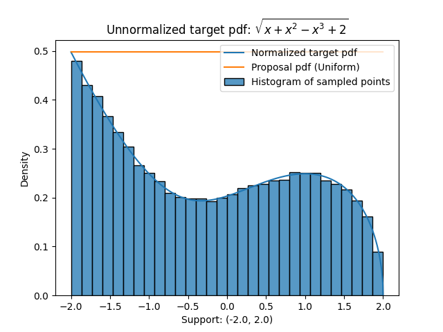

### Univariate-Truncated-Sampling for the project: "Sampling from a parametric polynomial curve"
*Sampling from univariate truncated distributions for GeomScale's tests for GSoC 2021*

## Easy
- Generated a 100 dimensional cube and sampled points using three different random walks:
  - ["Ball Walk", "Random Direction Hit and Run", "Change Direction Hit and Run"]
- Plots of sampled points projected along the first two dimensions: 
  

## Medium: Accept-Reject Sampling
* The code is written such that it also works for unnormalized pdf, maximum value **M** of **F(x)/G(x)** is calculated by evaluating the ratio over random uniform samples over the support.  
* The samples points were written into `data_1.txt` and `data_2.txt` and plotted using python file `plot.py`.  
* The pdfs are chosen with form similar to the density functions that can be obtained by norm of velocity vector of a parametric polynomial curve.  

1) **Target pdf (Unnormalized) (F) :**  sqrt(x + x2 - x3 + 2)
    - **Suppport :** (-2, 2)  
    - **Proposal pdf (G) :** Uniform (-2, 2)  
    - **Plots:**    
      
2) **Target pdf (Unnormalized) (F) :**  sqrt(4.5(x-1) + (x-1)2 - 4(x-1)3 - (x-1)4 + 3)
    - **Suppport :** (-3.0, 2.2)  
    - **Proposal pdf (G) :** Uniform (-3.0, 2.2)  
    - **Plots:**    
      

## Hard: Metropolis-Hastings algorithm
* The samples points were written into `data_1.txt` and `data_2.txt` and plotted using python file `plot.py`.  
* The pdfs are chosen with form similar to the density functions that can be obtained by norm of velocity vector of a parametric polynomial curve.  

1) **Target pdf (Unnormalized) (F) :**  sqrt(x + x2 - x3 + 2)
    - **Suppport :** (-2, 2)  
    - **Transition kernel pdf (G) :** Gaussian Distribution with standard deviation = 0.25  
    - **Plots:**    
      -   
      -   
2) **Target pdf (Unnormalized) (F) :**  sqrt(4.5(x-1) + (x-1)2 - 4(x-1)3 - (x-1)4 + 3)
    - **Suppport :** (-3.0, 2.2)  
    - **Transition kernel pdf (G) :** Gaussian Distribution with standard deviation = 0.65  
    - **Plots:**    
      -   
      -   
